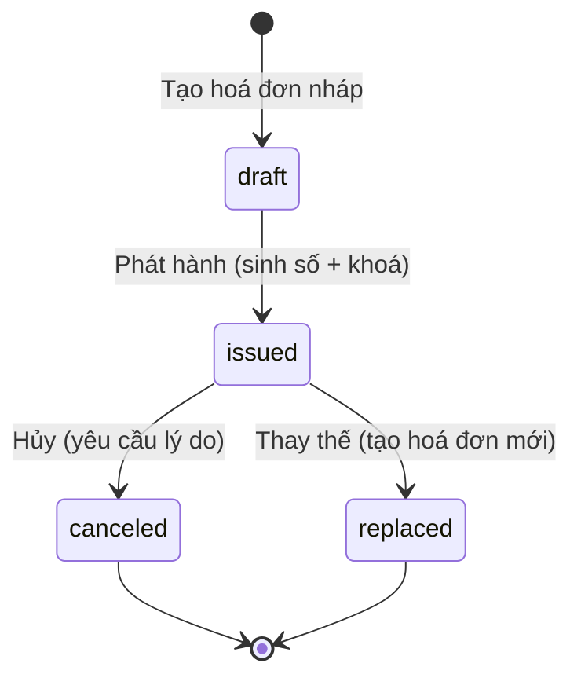

# 🧾 BINVOICE - Enterprise Invoice Management System

> **TL;DR**: CRUD hoá đơn với **trạng thái nghiệp vụ** (draft → issued → canceled → replaced), **đánh số hoá đơn atomic**, **xuất PDF** (watermark “ĐÃ HỦY”), **unit/integration/API tests**, **Postman collection**, **Prisma migrations**.

## 🎯 Tổng quan dự án

### Mục tiêu và phạm vi

- **Mục tiêu**: Kiểm tra nền tảng **TypeScript + REST + PostgreSQL** qua bài toán **xuất hóa đơn**.
- **Phạm vi**:
  - API hoá đơn: **draft / issue / cancel / replace** + CRUD.
  - **Đánh số hoá đơn** dạng `INV-{YYYY}-{sequence}` (atomic, transaction-safe).
  - **Xuất PDF** theo template HTML + watermark **“ĐÃ HỦY”** khi `canceled`.
  - **Unit-test / Integration / API E2E**, **Postman collection**.
  - **Prisma schema + migrations** (SQL).

### Business Logic Core



**Luật chính**

- **draft**: cho phép **sửa/xoá**.
- **issued**: **khóa chỉnh sửa**, chỉ cho cancel/replace.
- **canceled**: chỉ đọc, PDF có watermark “ĐÃ HỦY”.
- **replace**: tạo **hoá đơn issued mới**, liên kết **1–1** với hoá đơn cũ (`replacement_of_id` ↔ `replaced_by_id`).

## 🚀 Tính năng triển khai

### Quản lý vòng đời hoá đơn

- **Draft Management**: Tạo, sửa, xoá hoá đơn nháp với validation nghiêm ngặt
- **Atomic Numbering**: Hệ thống đánh số hoá đơn `INV-YYYY-XXXXXX` thread-safe
- **Replacement Logic**: Tạo hoá đơn thay thế với quan hệ 1-1 bidirectional

### Kỹ thuật áp dụng

- **Transaction Management**: Prisma transactions cho operations phức tạp
- **Concurrency Safe**: Race condition testing cho invoice numbering
- **Decimal Precision**: Xử lý tiền tệ chính xác với Prisma Decimal
- **Enterprise Architecture**: Repository + Service + Controller pattern

### PDF Generation System

- **Template Engine**: Handlebars templates với responsive design
- **Puppeteer Integration**: Server-side PDF rendering
- **Conditional Watermarking**: "ĐÃ HỦY" watermark cho canceled invoices
- **File Management**: Local storage với path tracking

## 🛠️ Tech Stack & Dependencies

### Core Technologies

| Technology     | Version | Purpose               |
| -------------- | ------- | --------------------- |
| **Node.js**    | 18+     | JavaScript runtime    |
| **TypeScript** | 5.9+    | Type-safe development |
| **Express.js** | 5.1+    | Web framework         |
| **PostgreSQL** | 14+     | Primary database      |
| **Prisma**     | 6.16+   | ORM & migrations      |
| **Puppeteer**  | 24+     | PDF generation        |

### Development & Quality

| Tool                  | Purpose                    |
| --------------------- | -------------------------- |
| **Jest + Supertest**  | Unit & integration testing |
| **ESLint + Prettier** | Code quality & formatting  |
| **Zod**               | Runtime validation         |
| **Handlebars**        | PDF templating             |
| **pnpm**              | Package management         |

## System Requirements

```bash
Node.js >= 18.0.0
pnpm >= 8.0.0
PostgreSQL >= 14.0.0
Git >= 2.30.0
```

## 🚀 Quick Start

### 1. Environment Setup

```bash
# Clone repository
git clone https://github.com/kennynguyen1603/binvoice-internship.git
cd binvoice-internship

# Setup environment
cp .env.example .env

# Install dependencies
pnpm install
```

### 2. Cấu hình cơ sở dữ liệu

Chỉnh sửa file `.env` với thông tin sau:

```bash
# Database Configuration - Sử dụng Prisma Accelerate
DATABASE_URL="prisma+postgres://accelerate.prisma-data.net/?api_key=YOUR_API_KEY"

# Server Configuration
NODE_ENV="development"
LOG_LEVEL="info"
HOST="localhost"
PORT=8080

# PDF Storage
PDF_STORAGE_DIR="./storage/pdf"

# Invoice Configuration
DEFAULT_SELLER_NAME="BINVOICE CO., LTD"
DEFAULT_SELLER_TAX_ID="0312345679"
DEFAULT_SELLER_ADDRESS="123 Business St, HCM City, Vietnam"

# Redis (Optional)
REDIS_URL="redis://localhost:6379"
```

### 3. Khởi tạo cơ sở dữ liệu

```bash

# Generate Prisma client
pnpm db:generate

# Chạy database migrations
pnpm db:migrate

# Seed dữ liệu mẫu (tùy chọn)
pnpm db:seed
```

### 4. Khởi động development server

```bash
# Start development server với hot reload
pnpm dev

# Server sẽ chạy tại http://localhost:8080
# API endpoints có sẵn tại http://localhost:8080/api/v1
```

### 5. Các lệnh hữu ích khác

```bash
# Kiểm tra code quality
pnpm lint

# Format code
pnpm prettier:fix

# Chạy tests
pnpm test

# Mở Prisma Studio để xem dữ liệu
pnpm db:studio

# Build cho production
pnpm build
```

## 📚 API Documentation

### Core Endpoints

| Method   | Endpoint                | Description      | Status Rules       |
| -------- | ----------------------- | ---------------- | ------------------ |
| `POST`   | `/invoices`             | Tạo draft        | ✅ Always          |
| `GET`    | `/invoices`             | List với filters | ✅ Always          |
| `GET`    | `/invoices/:id`         | Chi tiết invoice | ✅ Always          |
| `PATCH`  | `/invoices/:id`         | Cập nhật         | ⚠️ Draft only      |
| `DELETE` | `/invoices/:id`         | Xoá              | ⚠️ Draft only      |
| `POST`   | `/invoices/:id/issue`   | Phát hành        | ⚠️ Draft only      |
| `POST`   | `/invoices/:id/cancel`  | Hủy hoá đơn      | ⚠️ Issued only     |
| `POST`   | `/invoices/:id/replace` | Thay thế         | ⚠️ Issued only     |
| `POST`   | `/invoices/:id/pdf`     | Generate PDF     | ✅ Always          |
| `GET`    | `/invoices/:id/pdf`     | Download PDF     | ✅ If exists       |

### Request/Response Examples

#### Tạo Draft Invoice

```http
POST /invoices
Content-Type: application/json

{
  "buyerName": "Công ty TNHH ABC",
  "buyerTaxId": "0312345678",
  "buyerAddress": "123 Nguyễn Huệ, Q1, HCM",
  "dueDate": "2025-10-15",
  "items": [
    {
      "description": "Dịch vụ phát triển phần mềm",
      "quantity": "2",
      "unitPrice": "15000000",
      "taxRate": "10.00"
    }
  ],
  "notes": "Thanh toán trong 30 ngày"
}
```

#### Phát hành hoá đơn

```http
POST /invoices/{id}/issue

→ Response: 200 OK
{
  "id": "550e8400-e29b-41d4-a716-446655440000",
  "number": "INV-2025-000001",
  "status": "issued",
  "issueDate": "2025-10-01T10:30:00Z",
  "grandTotal": "33000000.00"
}
```

### Postman Collection

📁 **Import collection**: `/postman/BINVOICE_API_Collection.json`
📁 **File environment**: `/postman/BINVOICE_Environment.json`

**Quy trình kiểm thử**: Create Draft → Issue → Generate PDF → Download → Cancel/Replace → Generate PDF (Xem lại)

## 🧪 Chiến lược kiểm thử

### Phạm vi kiểm thử

```bash
# Chạy toàn bộ test suite
pnpm test

# Báo cáo coverage
pnpm test:coverage

# Chế độ watch
pnpm test:watch
```

### Phân loại kiểm thử

#### Unit Tests (6 bộ test, 19 test case)

- ✅ **Tiện ích tiền tệ**: Độ chính xác thập phân, làm tròn, tính toán
- ✅ **Hệ thống đánh số**: Validation format, tạo sequence
- ✅ **Logic service**: Chuyển đổi trạng thái, validation quy tắc nghiệp vụ

#### Integration Tests (2 bộ test, 16 test case)

- ✅ **Invoice service**: Kiểm thử workflow hoàn chỉnh
- ✅ **API endpoints**: Validation end-to-end request/response

#### Kiểm thử đồng thời (Concurrency Testing)

- ✅ **Ngăn chặn race condition**: Phát hành hoá đơn song song
- ✅ **Cô lập transaction**: Tính nhất quán dữ liệu dưới tải cao

### Kết quả kiểm thử hiện tại

```
Test Suites: 6 passed, 6 total
Tests:       35 passed, 35 total
Coverage:    > 85% (statements, branches, functions)
```

## 🏗️ Kiến trúc & Mẫu thiết kế

### Triển khai Clean Architecture

| Lớp          | Trách nhiệm                 |
| ------------ | --------------------------- |
| Controllers  | Xử lý HTTP Request/Response |
| Services     | Logic nghiệp vụ & quy tắc   |
| Repositories | Lớp truy cập dữ liệu        |
| Database     | PostgreSQL + Prisma         |

### Quyết định thiết kế chính

#### 1. Mẫu State Machine

- **Lý do**: Hoá đơn có workflow phức tạp với quy tắc nghiêm ngặt
- **Triển khai**: Validation ở service layer + ràng buộc DB
- **Lợi ích**: Chuyển đổi trạng thái type-safe, thực thi quy tắc nghiệp vụ

#### 2. Hệ thống đánh số nguyên tử

- **Thách thức**: Đảm bảo số hoá đơn duy nhất khi có concurrent requests
- **Giải pháp**: Database transaction + row-level locking trên `invoice_number_seq`
- **Kết quả**: Không có số trùng lặp dưới tải đồng thời cao

#### 3. Kiến trúc sinh PDF

- **Lựa chọn**: HTML template + Puppeteer vs thư viện PDF trực tiếp
- **Ưu điểm**: Styling linh hoạt, bảo trì dễ dàng, thiết kế responsive
- **Nhược điểm**: Bundle size lớn hơn, phụ thuộc Chromium
- **Lý do**: Tốc độ phát triển và tính linh hoạt UI vượt trội hơn kích thước bundle

### Thiết kế cơ sở dữ liệu

#### Sơ đồ quan hệ thực thể

```sql
-- Bảng chính và mối quan hệ
invoices (1) ←→ (n) invoice_items
invoices (1) ←→ (1) invoices (quan hệ thay thế)
invoice_number_seq (quản lý sequence theo năm)
```

#### Tối ưu hiệu suất

- **Composite indexes**: `(status, issue_date)`, `(status, created_at)`
- **Unique constraints**: Số hoá đơn, quan hệ thay thế
- **Cascade deletes**: Các item hoá đơn theo vòng đời hoá đơn

## 📊 Metrics phát triển & ước lượng

### Phân tích đầu tư thời gian

| Giai đoạn            | Ước lượng (h) | Thực tế (h) | Chênh lệch | Ghi chú                       |
| -------------------- | ------------- | ----------- | ---------- | ----------------------------- |
| Thiết lập dự án      | 1.5           | 2.0         | +33%       | Độ phức tạp cấu hình ESLint   |
| Schema cơ sở dữ liệu | 2.5           | 3.5         | +12        | Lặp lại migration             |
| CRUD cốt lõi         | 3.0           | 2.5         | -17%       | Hiệu quả Prisma               |
| State Machine        | 3.0           | 4.0         | +33%       | Độ phức tạp quy tắc nghiệp vụ |
| Hệ thống đánh số     | 1.5           | 2.5         | +67%       | Edge case đồng thời           |
| Sinh PDF             | 3.0           | 4           | +33%       | Lỗi CSS                       |
| Bộ kiểm thử          | 4.0           | 5.0         | +25%       | Kịch bản test đồng thời       |
| Tài liệu             | 1.0           | 2           | +100%      | Ví dụ toàn diện               |
| **Tổng cộng**        | **19.5**      | **24.0**    | **+23%**   | Bao gồm đường cong học tập    |

### Metrics chất lượng code

- **Độ nghiêm ngặt TypeScript**: 100% (không có `any` types)
- **Test Coverage**: >85% (statements, branches, functions)
- **Tuân thủ ESLint**: 0 vi phạm

## 🎯 Bài học kinh nghiệm

### Hiểu biết kỹ thuật

#### 1. **Độ chính xác thập phân trong ứng dụng tài chính**

```typescript
// ❌ Vấn đề độ chính xác float của JavaScript
const total = 0.1 + 0.2 // 0.30000000000000004

// ✅ Prisma Decimal cho độ chính xác tài chính
import { Decimal } from '@prisma/client/runtime/library'
const total = new Decimal('0.1').plus('0.2') // Chính xác: 0.3
```

#### 2. **Mẫu kiểm soát đồng thời**

```typescript
// Đánh số nguyên tử với database transaction
await prisma.$transaction(async (tx) => {
  const seq = await tx.invoiceNumberSeq.update({
    where: { year },
    data: { lastValue: { increment: 1 } }
  })
  // Quan trọng: Cập nhật invoice trong cùng transaction
  return formatInvoiceNumber(year, seq.lastValue)
})
```

#### 3. **Vòng đời của một invoice**

```typescript
// State machine với business rules nghiêm ngặt
export enum InvoiceStatus {
  DRAFT = 'draft', // Cho phép sửa/xóa tự do
  ISSUED = 'issued', // Khóa chỉnh sửa, chỉ cho phép cancel/replace
  CANCELED = 'canceled' // Chỉ đọc, không thay đổi
}

const validateStatusTransition = (currentStatus: InvoiceStatus, newStatus: InvoiceStatus) => {
  const allowedTransitions = {
    [InvoiceStatus.DRAFT]: [InvoiceStatus.ISSUED],
    [InvoiceStatus.ISSUED]: [InvoiceStatus.CANCELED],
    [InvoiceStatus.CANCELED]: []
  }

  if (!allowedTransitions[currentStatus].includes(newStatus)) {
    throw new Error(`Cannot transition from ${currentStatus} to ${newStatus}`)
  }
}
```

**Bài học rút ra**:

- **Hiểu nghiệp vụ cơ bản**: Vòng đời hoá đơn phản ánh quy trình thực tế trong kế toán
- **Quy tắc chỉnh sửa**: Draft có thể sửa, Issued bị khóa để đảm bảo tính pháp lý
- **State validation**: Implement business rules ở cả application và database level

#### 4. **Generate PDF với template động**

```typescript
// Template-based PDF generation với Handlebars + Puppeteer
export const generateInvoicePDF = async (invoice: Invoice): Promise<Buffer> => {
  // 1. Render HTML từ template
  const template = await fs.readFile('./templates/invoice.hbs', 'utf8')
  const compiledTemplate = Handlebars.compile(template)

  const html = compiledTemplate({
    invoice,
    showCanceledWatermark: invoice.status === 'canceled',
    formatCurrency: (amount: Decimal) => formatVND(amount),
    formatDate: (date: Date) => date.toLocaleDateString('vi-VN')
  })

  // 2. Convert HTML to PDF với Puppeteer
  const browser = await puppeteer.launch()
  const page = await browser.newPage()

  await page.setContent(html, { waitUntil: 'networkidle0' })

  const pdfBuffer = await page.pdf({
    format: 'A4',
    printBackground: true,
    margin: { top: '20mm', bottom: '20mm', left: '15mm', right: '15mm' }
  })

  await browser.close()
  return pdfBuffer
}
```

**Bài học rút ra**:

- **Template flexibility**: HTML/CSS dễ customize hơn PDF libraries thuần
- **Conditional rendering**: Watermark "ĐÃ HỦY" cho trạng thái canceled
- **Performance trade-off**: Puppeteer nặng nhưng cho output chất lượng cao
- **Production considerations**: Cần handle browser lifecycle và error gracefully

## 🚧 Thách thức & giải pháp

### 1. **Vấn đề triển khai Puppeteer**

**Vấn đề**: Phụ thuộc Chromium phức tạp trên production servers

```dockerfile
# Giải pháp: Dockerfile với system dependencies
RUN apt-get update && apt-get install -y \
    fonts-liberation libappindicator3-1 libasound2 \
    libatk-bridge2.0-0 libdrm2 libgtk-3-0 \
    libnspr4 libnss3 libx11-xcb1 libxcomposite1 \
    libxdamage1 libxrandr2 xdg-utils
```

**Phương án thay thế**: Tích hợp Playwright làm fallback option

### 2. **Quản lý migration cơ sở dữ liệu**

**Vấn đề**: Thay đổi schema trong môi trường phát triển nhóm

**Giải pháp**:

- Quy trình migration nghiêm ngặt: `prisma migrate dev` cho development
- Production: `prisma migrate deploy` với chiến lược rollback
- Phát hiện và xử lý schema drift

### 3. **Tuân thủ TypeScript Strict Mode**

**Vấn đề**: Các mẫu JavaScript cũ không tương thích

**Chiến lược**:

- Phương pháp migration từng bước
- Custom type guards cho runtime validation
- Utility types cho logic nghiệp vụ phức tạp

```typescript
// Các mẫu TypeScript nâng cao được sử dụng
type InvoiceByStatus<T extends InvoiceStatus> = T extends 'draft'
  ? DraftInvoice
  : T extends 'issued'
    ? IssuedInvoice
    : T extends 'canceled'
      ? CanceledInvoice
      : never
```

## 📁 Cấu trúc dự án

```
binvoice-internship/
├── 🎯 Core Application
│   ├── src/
│   │   ├── app.ts              # Thiết lập Express + middleware
│   │   ├── index.ts            # Entry point ứng dụng
│   │   ├── controllers/        # Xử lý HTTP request
│   │   ├── services/           # Lớp logic nghiệp vụ
│   │   ├── repositories/       # Lớp truy cập dữ liệu
│   │   ├── routes/            # Định nghĩa route API
│   │   └── schemas/           # Schema validation Zod
│   │
├── 🗄️ Database Layer
│   ├── prisma/
│   │   ├── schema.prisma      # Định nghĩa schema DB
│   │   ├── migrations/        # Thay đổi DB có version control
│   │   └── seed.ts           # Sinh dữ liệu mẫu
│   │
├── 🧪 Testing Suite
│   ├── tests/
│   │   ├── unit/             # Kiểm thử service & utility
│   │   ├── integration/      # Kiểm thử repository & API
│   │   └── fixtures/         # Dữ liệu test & helper
│   │
├── 📄 PDF System
│   ├── src/templates/        # Template Handlebars
│   ├── src/libs/pdf.ts      # Logic sinh PDF
│   └── storage/pdf/         # File PDF đã tạo
│   │
├── 📚 Documentation
│   ├── postman/             # Collection API & environment
│   ├── README.md            # Hướng dẫn toàn diện này
│   └── BINVOICE_PLAN.md     # Lộ trình phát triển
│   │
└── ⚙️ Configuration
    ├── tsconfig.json        # Cấu hình TypeScript compiler
    ├── eslint.config.mts    # Quy tắc chất lượng code
    ├── jest.config.js       # Thiết lập framework test
    └── .env.example         # Template môi trường
```

## 🔧 Scripts có sẵn

### Quy trình phát triển

```bash
# Phát triển
pnpm dev              # Khởi động với hot reload
pnpm build            # Build production
pnpm start            # Chạy production server

# Quản lý cơ sở dữ liệu
pnpm db:migrate       # Áp dụng schema migrations
pnpm db:generate      # Tạo lại Prisma client
pnpm db:studio        # Mở GUI cơ sở dữ liệu
pnpm db:seed          # Tải dữ liệu mẫu

# Đảm bảo chất lượng
pnpm test             # Chạy tất cả tests
pnpm test:watch       # Test ở chế độ watch
pnpm test:coverage    # Tạo báo cáo coverage
pnpm lint             # Kiểm tra chất lượng code
pnpm prettier:fix     # Format codebase
```

## 📞 Liên hệ & hỗ trợ

- **Tên**: Nguyễn Ken Ny
- **Email**: kennynguyen1603.young@gmail.com
- **GitHub**: [@kennynguyen1603](https://github.com/kennynguyen1603)
- **Repository dự án**: [binvoice-internship](https://github.com/kennynguyen1603/binvoice-internship)
